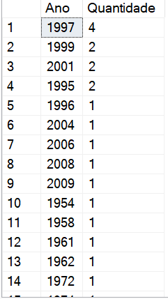
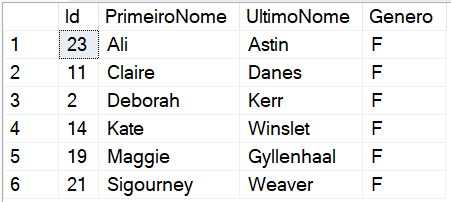

# DIO - .NET Track - Database
www.dio.me

## Project challenge
For this challenge, you will need to use your knowledge acquired in the database module of DIO's .NET track.

## Context
You are responsible for the database of a movie website, where data about movies and their actors is stored. You have therefore been asked to perform a query on the database in order to bring up some data for analysis.

## Proposal
You will need to perform 12 queries on the database, each returning a different type of information.
Your database is modeled as follows:

The tables are described as follows:

**Filmes**

Table responsible for storing movie information.

**Atores**

Table responsible for storing actor information.

**Generos**

Table responsible for storing movie genres.

**ElencoFilme**

Table responsible for representing a many-to-many relationship between films and actors, i.e. an actor can work in many films, and films
can have many actors.

**FilmesGenero**

Table responsible for representing a many-to-many relationship between films and genres, i.e. a film can have more than one genre, and a genre can be part of many films.

## Preparing the database
You must run the file **Script Filmes.sql** in your SQL Server database, in the Scripts folder of this repository ([or click here](Script%20Filmes.sql)). This script will create a database called **Films**, containing the tables and data you need to carry out this challenge.

## Objective
You will have to create several queries in order to return the following data. Below each request is the expected return. Your return should be the same as the image.

## 1 - Search for the name and year of the movie

## 2 - Search by movie name and year, sorted in ascending order by year

## 3 - Search for the movie De Volta para o Futuro, bringing up the name, year and duration

## 4 - Search for films released in 1997

## 5 - Search for films released AFTER 2000

## 6 - Search for films with a running time greater than 100 and less than 150, sorting by running time in ascending order

## 7 - Search for the number of films released in the year, grouped by year, sorted by length in descending order

## 8 - Search for male Actors, returning PrimeiroNome, UltimoNome

## 9 - Search for female Actors, returning PrimeiroNome, UltimoNome, and sorting by PrimeiroNome

## 10 - Search for the name of the movie and the genre

## 11 - Search for the name of the movie and the genre "Mistério"

## 12 - Search for the name of the movie and the actors, bringing up the PrimeiroNome, UltimoNome and their Papel

